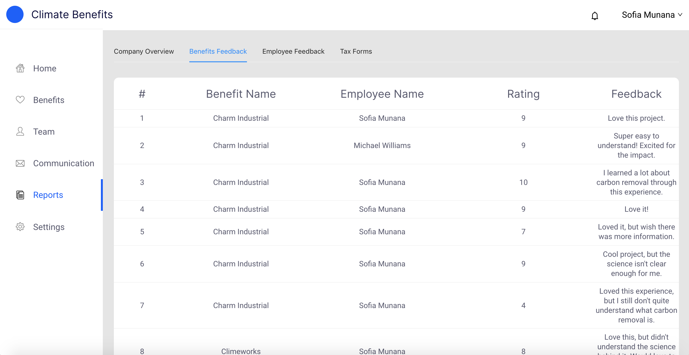

# Benefits Feedback 

After an Employee makes a contribution to a Climate Benefits Provider, we ask them for feedback on their experience with that provider. Employers are able to use this feedback data to customize the benefit for their Employees. 

At Climate Benefits, we understand that some environmental projects are tough to understand or don’t provide the transparency needed for the Employee Contributions. In an effort to maintain a competitive and meritocratic marketplace, we only work with providers that maintain a 8.0 or more rating from Employees. 

To access the Benefits Feedback data:   
1. Go to the [Reports](https://www.app.climatebenefits.com/employer/reports) page. 
2. Click on the Benefits Feedback sub-navigation. 
3. View the data table for incoming feedback. 

