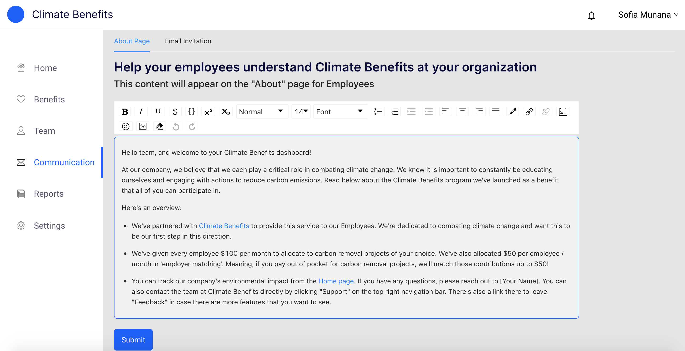

import ReactPlayer from 'react-player'

# Communication 

Employers are able to customize the text that appears on the Employee’s About page. This content is usually the first context that the Employee is given about the new benefits program. 

To customize the About page content:   
1. Go to the [Communications](https://www.app.climatebenefits.com/employer/communication) page. 
2. Make sure you’re on the About Page sub-navigation. 
3. Using the Rich Text Editor, add content. 
4. When done, click on the blue ‘Submit’ button. 

For templates or suggestions, email us at [support@climatebenefits.com](mailto:support@climatebenefits.com)

    

<ReactPlayer playing url='../../src/assets/Email Invitation.mov'
                height='500px'
                width='800px'
                controls='true'
/>