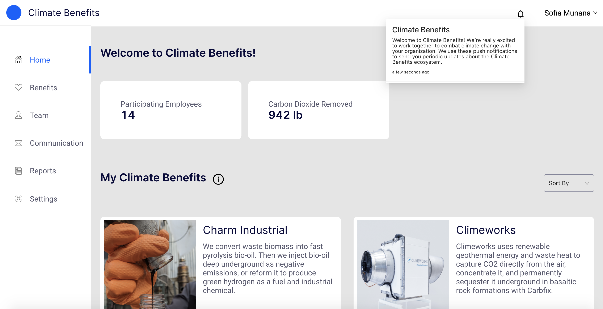

# Notifications  

Climate Benefits sends all users push notifications that appear on the top right of the web page, within the bell icon. Notifications are sent to update users on new features, bug fixes, new partnerships, and promotions. 

We aim to send 1 notification per month since we know these can be annoying. 

