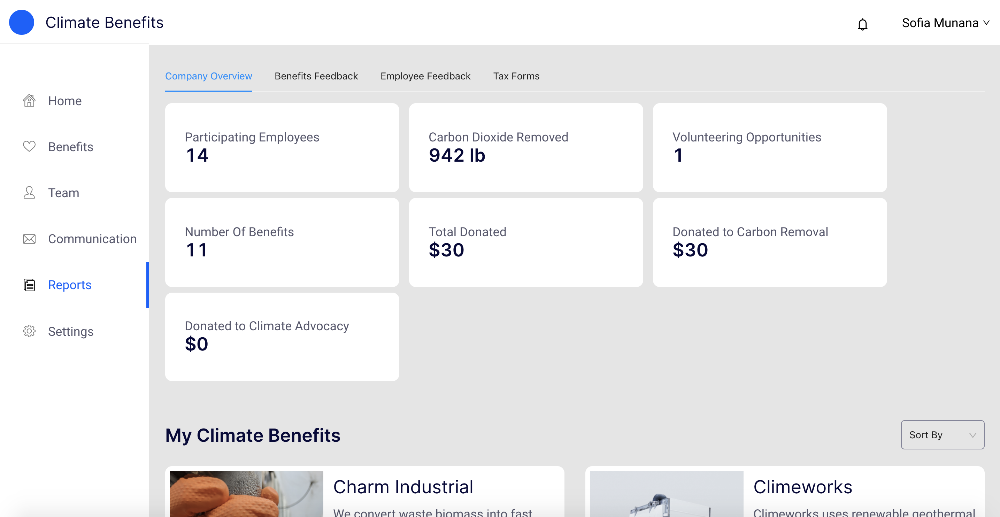

# Reports Dashboard 

Data is essential to prove the value of any benefits program. We enable Employers to view holistic data about the efficacy of Climate Benefits from the Report page. 

The following data points are available:    
* Participating Employees 
* Carbon Dioxide Removed 
* Volunteering Opportunities 
* Number of Benefits 
* Total Donations through Climate Benefits 
* Total Donated to Carbon Removal Projects 
* Total Donated to Climate Advocacy 

